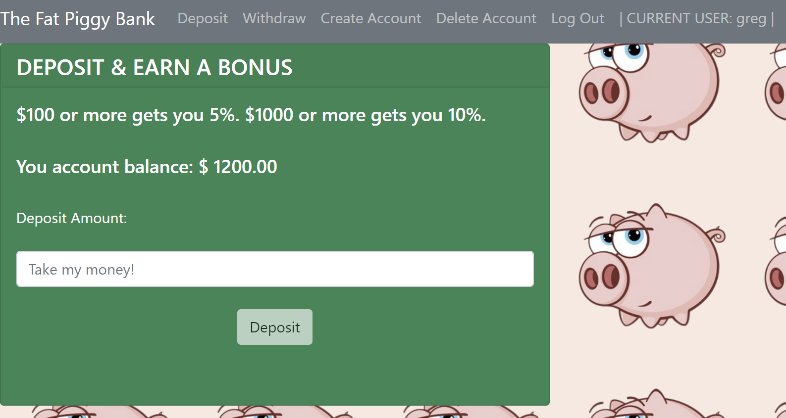

<h1></h1>

# The Fat Piggy Bank - Full Stack Application
> MIT xPRO - Capstone Project

This project was the final project in the MIT xPRO Full-Stack development course taken.

## Description

This was a project to learn how to develop a full stack application with an end goal of having a secure and functional banking platform. 

The app will help people who are in need of basic, but secure banking services. The app will however help the developer the most as he will need to have implemented many learnings to get the app up and running.

This app was build to learn to integrate various technologies to produce a useful product. It will solve both business (for the end user) and personal (for the developer) problems.

## Screenshots

## Features and Improvements

The project has the following features:
* Authentication for current users
* Ability to create new accounts for new users
* Ability to view balances and other user specific information
* Ability to both deposit and withdraw funds and have an updated balance as well as earn bonuses on new deposits
* Improved security with the use of hashed passwords, JWT and bcrypt
* The use of an Express Router
* MongoDB Atlas as a backend DB with the help of Mongoose
* Launched and hosted on Heroku

There are many improvements in the pipeline, such as:
* Improved UX
* More functionality, like calculating interest and adding savings products 
* The ability to search for and save stock prices

## Installation (How to run)

Clone the files that are in the Git Hub directory to your local machine.
Open the terminal window in the respective cloned directory.
Run the `npm install` command in the terminal window to ensure all the dependencies listed in the package.json file are installed in both the root and client directories.
Once that is complete, in the same terminal window, run the `npm start` command in both the root folder as well as the client folder.
This is in order to launch the server side and client side.
This will start the project on the following url http://localhost:3000/ 
Navigate to the url and you will be able to interact with the project.
ALternatively, visit the hosted URL on https://gregory-shaw-banking-app.herokuapp.com/

## Technology used

The following technologies have been used in building this project:
* React
* Node.js
* Express
* MongoDB
* Mongoose
* JWT
* Axios
* bcrypt
* CORS
* Heroku

## Versioning

Version 1.25.1

## License

Copyright (c) 2021 Gregory Shaw 

(MIT Template)

Permission is hereby granted, free of charge, to any person obtaining a copy
of this software and associated documentation files (the "Software"), to deal
in the Software without restriction, including without limitation the rights
to use, copy, modify, merge, publish, distribute, sublicense, and/or sell
copies of the Software, and to permit persons to whom the Software is
furnished to do so, subject to the following conditions:

The above copyright notice and this permission notice shall be included in all
copies or substantial portions of the Software.

THE SOFTWARE IS PROVIDED "AS IS", WITHOUT WARRANTY OF ANY KIND, EXPRESS OR
IMPLIED, INCLUDING BUT NOT LIMITED TO THE WARRANTIES OF MERCHANTABILITY,
FITNESS FOR A PARTICULAR PURPOSE AND NONINFRINGEMENT. IN NO EVENT SHALL THE
AUTHORS OR COPYRIGHT HOLDERS BE LIABLE FOR ANY CLAIM, DAMAGES OR OTHER
LIABILITY, WHETHER IN AN ACTION OF CONTRACT, TORT OR OTHERWISE, ARISING FROM,
OUT OF OR IN CONNECTION WITH THE SOFTWARE OR THE USE OR OTHER DEALINGS IN THE
SOFTWARE.

## Team
* [Greg Shaw](https://github.com/greg4shaw)
